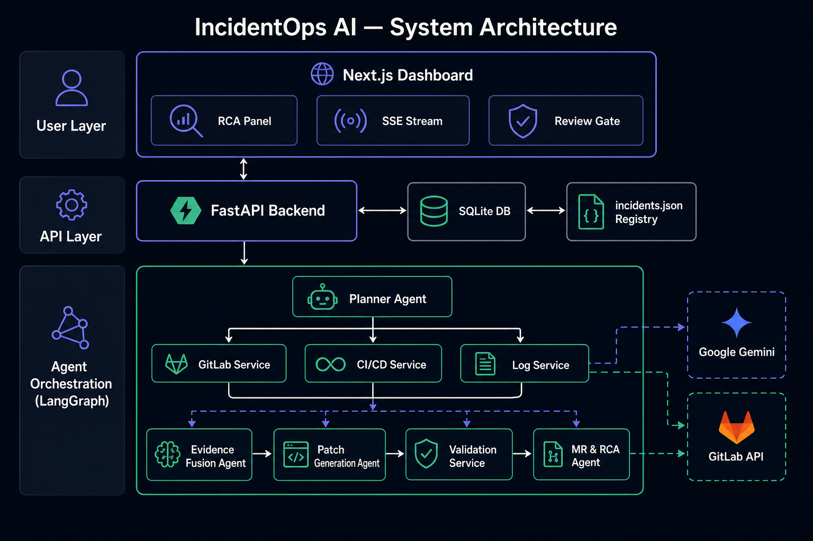
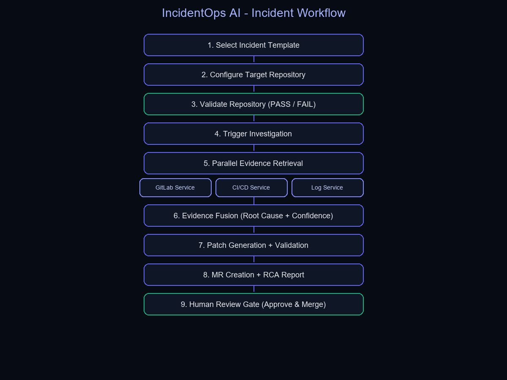

# IncidentOps AI

Autonomous Tier-3 incident response platform that investigates production failures, correlates evidence from GitLab, CI/CD, and runtime logs, generates validated patches, and opens remediation merge requests with a full root cause analysis.

**Repository:** [github.com/swankystark/IncidentOps-AI](https://github.com/swankystark/IncidentOps-AI)  
**Benchmark target app (GitLab):** [swankystark20-group/incidentops-demo-app](https://gitlab.com/swankystark20-group/incidentops-demo-app)

---

## Problem Statement

On-call engineers spend critical minutes manually correlating logs, pipeline failures, commit history, and source code before they can even propose a fix. IncidentOps AI automates that investigation loop: it scopes the incident, collects evidence from GitLab, CI/CD, and runtime logs, fuses signals into a root-cause hypothesis, drafts a minimal patch, validates it, and opens a GitLab merge request with an RCA report — all while keeping a human in the loop at the review gate.

---

## Architecture



IncidentOps AI is a **Next.js dashboard** connected to a **FastAPI + LangGraph backend** with **SQLite** persistence.

| Layer | Technology | Role |
|-------|------------|------|
| Frontend | Next.js, React, Tailwind | Incident dashboard, live SSE streaming, RCA panel |
| API | FastAPI | REST endpoints, config, incident lifecycle |
| Orchestration | LangGraph | Multi-agent workflow with dedicated evidence retrieval services |
| Reasoning | Google Gemini | Structured evidence fusion, patch generation, RCA authoring |
| Integrations | GitLab API | Commits, files, pipelines, branches, merge requests |
| Storage | SQLite | Incidents, agent logs, platform metrics |

### Agent Taxonomy

- **Planner Agent** — scopes module, error type, and retrieval signals
- **GitLab / CI/CD / Log Services** — evidence collection from commits, pipelines, and logs
- **Evidence Fusion Agent** — correlates signals into root cause + confidence
- **Patch Generation Agent** — produces a minimal unified diff
- **Validation Service** — runs template-selected pytest strategy
- **MR & RCA Agent** — commits patch, opens MR, writes RCA markdown

See [docs/architecture.md](docs/architecture.md) for the full system diagram.

---

## Workflow



1. Select an incident template from `incidents.json`
2. Configure target GitLab repository, branch, app path, and log path
3. **Validate Repository** — verify project, branch, and GitLab access before running
4. Trigger investigation — LangGraph executes the agent pipeline
5. Watch live agent logs via Server-Sent Events
6. Review RCA panel: root cause, evidence, affected files, confidence
7. Inspect generated patch diff
8. Approve merge request at the human review gate

See [docs/workflow.md](docs/workflow.md) and [docs/demo_walkthrough.md](docs/demo_walkthrough.md).

---

## Repository-Agnostic Design

IncidentOps AI does **not** hardcode a target repository. Each incident run stores:

- `target_repo` — GitLab `group/project` path
- `target_branch` — branch to investigate
- `target_app_path` — subdirectory for application source (empty = repo root)
- `application_log_path` — local or configured log file path

The UI starts with **empty defaults**. Click **Apply Demo Preset** to load the benchmark configuration used in evaluation:

```
swankystark20-group/incidentops-demo-app / main / invoice-app
```

The benchmark application itself lives in a separate GitLab repository and is not included in this GitHub repo.

---

## GitLab Integration

| Capability | Description |
|------------|-------------|
| Project lookup | Validates repository exists and is accessible |
| Branch access | Confirms target branch is reachable |
| Commit history | Retrieves suspicious commits for correlation |
| Source files | Fetches target and supporting files from the repo |
| Pipeline evidence | Selects relevant CI/CD pipeline and job traces |
| Remediation | Creates branch, commits patch, opens merge request |

Requires a GitLab Personal Access Token with `api` scope.

---

## Configuration

### Backend (`.env` at repository root)

Copy `.env.example` to `.env`:

```bash
cp .env.example .env
```

| Variable | Required | Description |
|----------|----------|-------------|
| `GEMINI_API_KEY` | Yes | Google Gemini API key |
| `GITLAB_PAT` | Yes | GitLab personal access token |
| `GITLAB_TARGET_REPO` | No | Default target repo (overridable in UI) |
| `GITLAB_TARGET_BRANCH` | No | Default branch (default: `main`) |
| `TARGET_APP_PATH` | No | App subdirectory in target repo |
| `APPLICATION_LOG_PATH` | No | Runtime log path for log agent |
| `DEMO_MODE` | No | Enable local pytest/log fallbacks (default: `true`) |

### Frontend (`frontend/.env.local`)

```bash
cp frontend/.env.example frontend/.env.local
```

| Variable | Required | Description |
|----------|----------|-------------|
| `NEXT_PUBLIC_API_BASE_URL` | Yes | Backend URL, e.g. `http://localhost:8000` |

---

## Running Locally

### Prerequisites

- Python 3.11+
- Node.js 18+
- GitLab PAT with API access
- Gemini API key

### 1. Backend

```bash
cd backend
python -m venv venv
# Windows
venv\Scripts\activate
# macOS/Linux
source venv/bin/activate

pip install -r requirements.txt
uvicorn app.main:app --reload --port 8000
```

### 2. Frontend

```bash
cd frontend
cp .env.example .env.local
# Edit .env.local: NEXT_PUBLIC_API_BASE_URL=http://localhost:8000
npm install
npm run dev
```

Open **http://localhost:3000**

### 3. Quick demo

1. Paste your Gemini API key in the header (or set `GEMINI_API_KEY` in `.env`)
2. Click **Apply Demo Preset** for the benchmark GitLab repository
3. Click **Validate Repository** — expect `PASS`
4. Trigger **INC-101**, **INC-102**, or **INC-103**
5. Watch the orchestration map, RCA panel, and patch diff populate in real time

### Docker (optional)

```bash
cp .env.example .env
# Fill in GEMINI_API_KEY and GITLAB_PAT
docker compose up --build
```

### CLI scenario runner

```bash
python run_scenario.py INC-101 --target-repo group/project --target-branch main
```

---

## Screenshots

> Add dashboard screenshots to `docs/assets/screenshots/` after your first local run.

Recommended captures:

1. Incident scenario panel with demo preset and validation PASS
2. Multi-agent orchestration map during investigation
3. RCA panel with confidence score and evidence sources
4. Patch diff and merge request review gate

---

## Benchmark Results

Evaluation harness: `tools/benchmark/run_benchmark.py`

| Scenario | Success Rate | Mean Confidence | Mean Duration |
|----------|-------------|-----------------|---------------|
| INC-101 (currency regression) | 100% | 98% | ~50s |
| INC-102 (auth null pointer) | 66.7% | 97% | ~42s |
| **Overall (6 runs)** | **83.3%** | **97.5%** | **~46s** |

Full report: [tools/benchmark/benchmark_report.md](tools/benchmark/benchmark_report.md)

---

## Limitations

- Validation strategies are pytest-based; non-Python repos need additional strategies
- Local log triggering requires a checkout of the target application
- Patch generation depends on LLM structured output matching source exactly
- Human merge gate simulates approval; production would wire GitLab MR merge API
- Metrics are portfolio-grade, not SLO-grade observability

See [docs/limitations.md](docs/limitations.md).

---

## Future Work

- Structured RCA fields on the incident API (not only markdown)
- Log provider integrations (Datadog, Splunk, CloudWatch)
- Durable job queue (Celery/ARQ) instead of FastAPI background tasks
- Additional validation strategies (npm, Maven, Go test)
- Real GitLab MR merge on human approval
- Postgres migration with proper schema migrations

---

## Project Structure

```
IncidentOps-AI/
├── backend/           # FastAPI + LangGraph agents
├── frontend/          # Next.js dashboard
├── docs/              # Architecture, workflow, portfolio assets
├── tests/             # Platform unit tests
├── tools/benchmark/   # Evaluation harness and reports
├── incidents.json     # Incident scenario registry
├── run_scenario.py    # CLI scenario runner
└── docker-compose.yml
```

---

## License

MIT (add license file before public release if desired).
