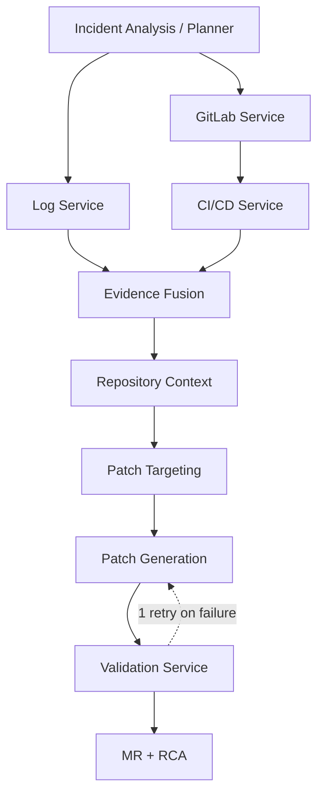
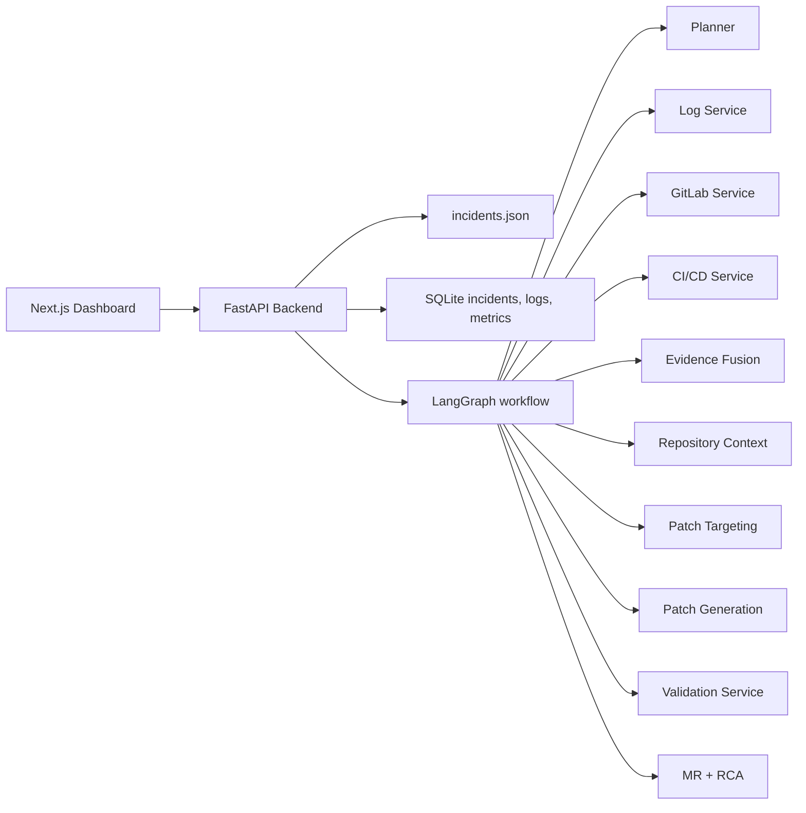
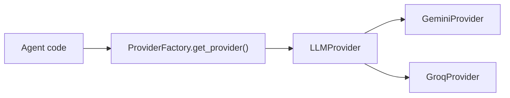

# IncidentOps AI Architecture

IncidentOps AI is a repository-agnostic incident-response system. It starts from a planner, gathers GitLab and log evidence, correlates CI/CD output, then produces a validated patch and an MR with RCA.

## What The Code Actually Does

The current LangGraph implementation is not fully parallel at the top. The planner fans out to log retrieval and GitLab attribution, and GitLab then feeds CI/CD before evidence fusion.

## System Boundary

## Component Roles

### Reasoning Nodes
- `planner`: scopes the incident and selects retrieval signals
- `evidence_fusion`: correlates logs, GitLab, and CI/CD evidence into a root cause
- `patch_targeting`: narrows the edit to the exact code region
- `patch_generation`: emits the source diff
- `mr_creation`: writes the RCA, creates the branch, commits, and opens the MR

### Deterministic Services
- `log_service`: extracts runtime evidence from the configured application log
- `gitlab_service`: fetches commits, files, branches, pipelines, and MR data
- `cicd_service`: collects pipeline and job evidence for the pinned commit
- `repository_context`: finds related files, imports, tests, and recent commits
- `validation_service`: runs the template-selected validation strategy

## Workflow Notes

1. `planner` runs first.
2. `log_service` and `gitlab_service` are both entered from the planner.
3. `gitlab_service` selects the commit context used by `cicd_service`.
4. `evidence_fusion` waits for log and CI/CD evidence.
5. `repository_context` enriches the affected file with deterministic context only.
6. `patch_generation` prepares the patch target.
7. `validation_service` can send the flow back to patch generation once.
8. `mr_creation` finalizes the remediation and posts the RCA.

## Recovery Path

- Quota or rate-limit failures checkpoint the incident state in SQLite.
- The incident can be resumed through `POST /api/incidents/{incident_id}/resume`.
- Resumed runs re-enter the LangGraph from the saved `checkpoint_state`.

## Provider Abstraction

Runtime selection is controlled by `MODEL_PROVIDER`. Benchmarks use Groq where possible to reduce quota pressure.

## Relevant Code Paths

- `backend/app/agents/graph.py`
- `backend/app/agents/fusion_agent.py`
- `backend/app/agents/repository_context.py`
- `backend/app/agents/patch_agent.py`
- `backend/app/agents/validation_agent.py`
- `backend/app/agents/mr_agent.py`
