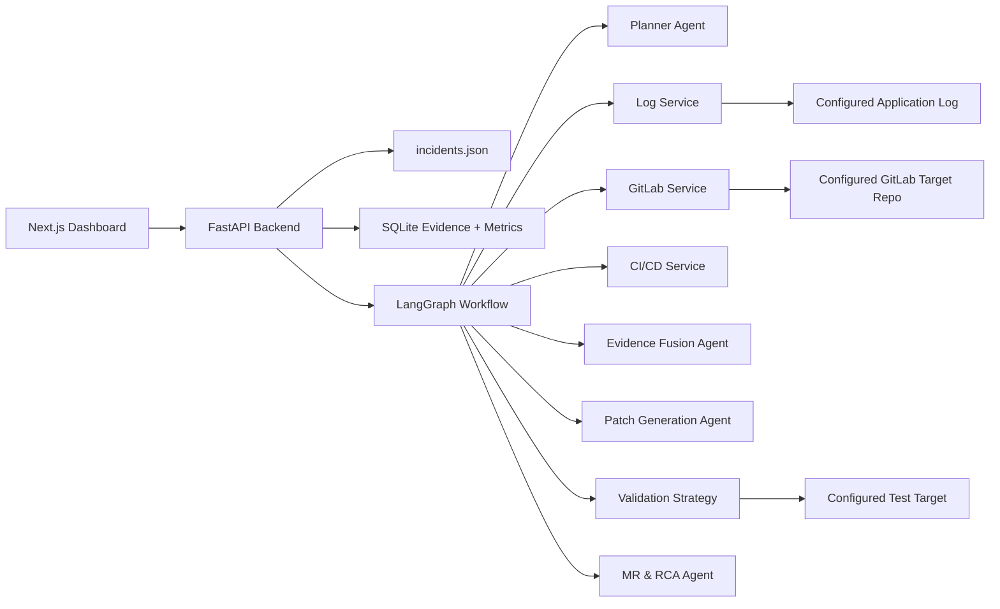

# IncidentOps AI Architecture

IncidentOps AI is a repository-agnostic incident-response platform. It investigates a configured GitLab target repository, correlates runtime logs, CI/CD evidence, commit history, and source files, then proposes a patch and opens a remediation merge request.

## System Boundary



## Agent Taxonomy

Planner Agent: scopes the incident, suspected module, error type, time window, and retrieval signals.

Evidence Fusion Agent: correlates GitLab, CI/CD, and log evidence into a root-cause hypothesis and confidence score.

Patch Generation Agent: generates a minimal source patch for the affected file.

MR & RCA Agent: commits the patch to the configured GitLab target repository, opens a merge request, and writes an RCA report.

## Service Taxonomy

GitLab Service: retrieves project metadata, commits, source files, pipeline status, job traces, creates branches, commits, merge requests, and MR notes.

Log Service: reads the configured application log path and extracts runtime anomalies.

CI/CD Service: retrieves GitLab pipeline/job evidence when available, with a local pytest fallback for benchmark execution.

Validation Service: delegates validation to a registered strategy selected by the incident template.

## Configuration

The platform reads repository and benchmark settings from environment variables:

```text
GITLAB_TARGET_REPO=group/project
GITLAB_TARGET_BRANCH=main
GITLAB_BASE_URL=https://gitlab.com
TARGET_APP_PATH=invoice-app
APPLICATION_LOG_PATH=invoice-app/application.log
INCIDENT_REGISTRY_PATH=incidents.json
```

`GITLAB_PROJECT` is still accepted as a backward-compatible alias, but new configuration should use `GITLAB_TARGET_REPO`.

## Repository-Agnostic Execution

Each incident run stores its selected `target_repo` and `target_branch`. Backend services instantiate a GitLab client from that per-run state, so different investigations can target different repositories without code changes.

For the default benchmark, `TARGET_APP_PATH=invoice-app` tells GitLab file operations that application files live under that subdirectory in the target repository. For repositories whose source lives at the repository root, set `TARGET_APP_PATH=` and `APPLICATION_LOG_PATH` to the desired log file.
